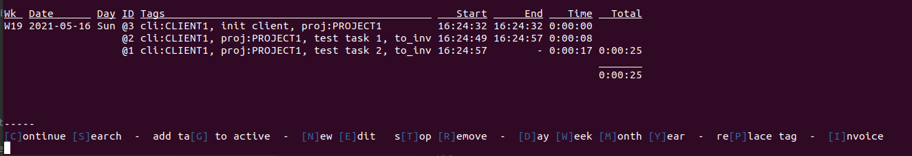
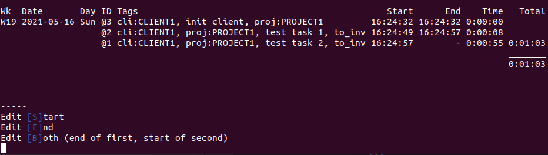

# Timewarrior Bash Utility

A little bash script that provides some shortcuts for TimeWarrior.
## Install

```
git clone https://gitea.nacq.me/nicolas/timewarrior-bash-utility.git

```
## Run
```
bash timewarrior-bash-utility/timetrack.sh

```

## Requierement

Clients and projects has to be created with `timew` directly
```
timew start cli:CLIENT1 proj:PROJECT1 'init client';timew stop
```

## Features : 

 - Start & Stop timer in one key
 - Continue previous task
 - Search previous task by client and continue it
 - Replace tag by another tag in selection (usefull to mark some tasks as invoiced)
 - Add tag to active timer
 - Edit start time or end time 
 - Edit end time of task and start time of next task
 - Display report of task to be invoiced for a client (grouped by projects, and tasks, sorted by grouped tasks time)
 - Display simplified version of the time visualisation of the month
 - Export report to file to share refreshed report via a cron task

## Screenshots




 ## Export report 

Set keybord shortcuts to parameters : 
- `i` for invoice
- client tag
- `y` for year
- `y` for Yes only to be invoiced task

 ```
(bash timetrack.sh i cli:CLIENT_NAME y y) > report.html
 ```

 ## Exemple of report 

 ```

       7    8    9    10   11   12   13   14   15   16   17      
---  1                                                        
     2                                                        
     3                       ------     ------ ------            5:31
     4         ---                  -----                        1:37
     5       --                                 ---- --          1:35
     6                                                   --      0:28
     7                                ----- -----    --          2:13
     8                                                        
     9                                                        
    10                                                        
    11              -                         ---      -         0:53
    12          ---                                              0:34
    13       --------       -                                    1:58
    14                                                        
    15                                                        
    16                                                        
    17                                                        
    18                                                        
    19                                                        
    20                                                        
    21                                                        
    22                                                        
    23                                                        
    24                                                        
    25                                                        
    26                                                        
    27                                                        
    28                                                        
    29                                                        
    30                                                        
    31                                                        
                                                                
                                                                14:52
CLIENT_NAME - This year - Only tasks to be invoiced
--------
Projects : 
     12:37:31 = design
     2:15:22 = web
     
--------
Travaux : 
     0:27:25 = web 'Contact form revie'
     1:06:08 = design 'Mockup for the winter sales ad'
     1:47:57 = web 'issue #922'
     2:18:08 = design 'New home page'
     2:25:21 = design 'run some tests'
     6:47:54 = design 'Drinking a lot of tea'
     
--------
Total : 
     14:52:53


 ```


 ## To do

 A lot. But for now it's enough for me. 

 Known bugs : 
  - You have to exit and re-run the script to cancel and return to main menu (#1)
  - After a while, the bash crash probably because of recursive loop into the main menu (#2)